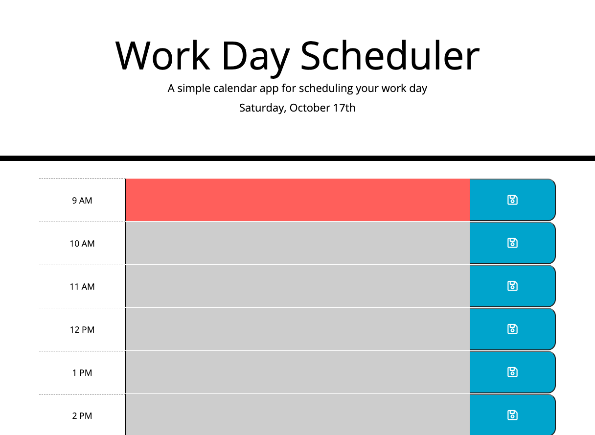

# 05_Day_Planner

## Description

This day planner web application was my fifth homework assignment in the KU Coding Boot Camp. The purpose of this assignment was to experience how coding in jQuery can greatly reduce the amount of code necessary to create web applications that are just as interactive and robust as standard JavaScript applications.

This particular web application required me to research and utilize Moment.js for working with dates and times. It also required the use of Local Storage for storing the user inputs on each time block.

## Acceptance Criteria

The application itself had the following Acceptance Criteria:

```text
GIVEN I am using a daily planner to create a schedule
WHEN I open the planner
THEN the current day is displayed at the top of the calendar
WHEN I scroll down
THEN I am presented with time blocks for standard business hours
WHEN I view the time blocks for that day
THEN each time block is color-coded to indicate whether it is in the past, present, or future
WHEN I click into a time block
THEN I can enter an event
WHEN I click the save button for that time block
THEN the text for that event is saved in local storage
WHEN I refresh the page
THEN the saved events persist
```

-----

## Deployed Version

<https://timothykemp.dev/05_day_planner>

-----

## Screenshots & Functionality Explanations

The following image shows the web application's appearance upon the initial load:



-----

## Important Notes

1. The HTML and CSS files were provided for me. My assignment was to create and code the JavaScript file from scratch, and I did make some minor updates to the CSS file as well.

-----

## Third-Party Libraries

[Bootstrap CSS](https://stackpath.bootstrapcdn.com/bootstrap/4.3.1/css/bootstrap.min.css)

[Font Awesome](https://use.fontawesome.com/releases/v5.8.1/css/all.css)

[Google Fonts](https://fonts.googleapis.com/css?family=Open+Sans&display=swap)

[jQuery](https://code.jquery.com/jquery-3.4.1.min.js)

[Moment.js](https://cdnjs.cloudflare.com/ajax/libs/moment.js/2.24.0/moment.min.js)

-----

## Credits

Built & designed by Timothy Kemp
